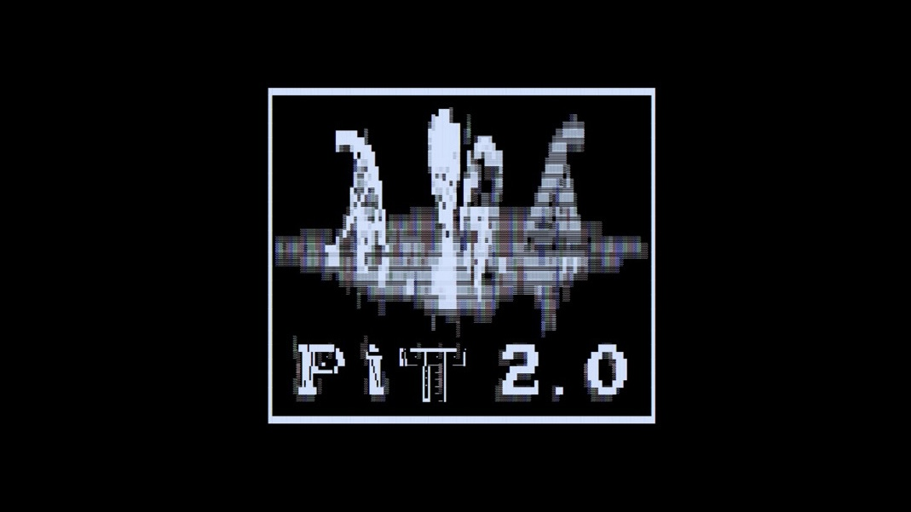

# PIT2.0 — R Analysis Suite
## PIT2.0 Research Paper Analysis

---

## Overview

This suite of R scripts performs a comprehensive statistical analysis of the Piticot Nash experiment: a reinforcement learning study examining how moral constraints (`moral_weight`) affect the emergence of spite-driven strategies in a two-player board game. The experiment is grounded in John Nash's Game Theory: specifically, it tests whether a Q-learning agent develops a Nash Equilibrium strategy of mutual destruction (triggering square 24) when winning becomes difficult.

The analysis is structured to support a research paper on **Spite, Equilibrium, and Moral Constraint
in Reinforcement Learning**.

---

## Prerequisites

**R version 4.2 or higher** is required. All packages are installed automatically by `00_setup.R`.

Key packages used:
- `tidyverse` — data wrangling throughout
- `ggplot2` + `patchwork` — all visualisations
- `lme4` + `lmerTest` — mixed-effects models
- `coin` — permutation and exact distribution-free tests
- `effsize` — Cohen's d and h effect sizes
- `broom` + `broom.mixed` — tidy model output
- `gt` — publication-quality tables
- `viridis` — colorblind-safe palettes

---

## Directory Structure

```
pit2.0-analysis/
├── R/
│   ├── 00_setup.R                  # Package installation + shared config
│   ├── 01_phase0_calibration.R     # Phase 0: baseline null hypothesis
│   ├── 02_phase1_baseline.R        # Phase 1: self_play vs vs_random
│   ├── 03_phase2_moral_sweep.R     # Phase 2: core MW sweep (PRIMARY)
│   ├── 04_phase3_reproducibility.R # Phase 3: seed stability + CIs
│   ├── 05_phase4_dynamic.R         # Phase 4: moral hysteresis
│   ├── 06_phase5_opponents.R       # Phase 5: opponent type comparison
│   ├── 07_decisions_strategy.R     # Decision-level + Q-value analysis
│   ├── 08_nash_equilibrium.R       # Formal Nash Equilibrium analysis
│   └── 09_comprehensive_summary.R  # Master figures + ethics conclusions
├── run_all.R                       # Single entry point — runs everything
├── output/                         # All plots, CSVs, tables (auto-created)
├── my-outputs/
├── pit2.0-research-paper           # Full research paper
└── README.md                       # This file
```

Place this `pit2.0-analysis/` folder next to your `data/` folder so that `data/runs/` is accessible from within `pit2.0-analysis/`.

---

## How to Run

### Option A — Run everything at once (recommended)

```r
setwd("path/to/pit2.0-analysis")
source("run_all.R")
```

This runs all 10 scripts in order and saves every output to `output/`. Takes approximately 5–15 minutes depending on machine speed, because the decision-level data (hundreds of thousands of rows) requires fitting mixed-effects models.

### Option B — Run scripts individually

```r
setwd("path/to/pit2.0-analysis")
source("R/00_setup.R")          # Must run first — installs packages
source("R/03_phase2_moral_sweep.R")  # Run any script independently
```

Every script re-sources `00_setup.R` at the top, so they are all self-contained.

### Option C — Command line

```cmd
Rscript run_all.R
```

---

## Data Requirements

The scripts expect a `data/runs/` directory (relative to the analysis folder) containing the experiment CSV files. The required files are:

| File pattern | Used by |
|---|---|
| `*_episodes.csv` | All scripts |
| `*_decisions.csv` | `07_decisions_strategy.R` |
| `*_meta.json` | `09_comprehensive_summary.R` |

If your `data/runs/` folder is in a different location, edit the `DATA_DIR` variable at the top of `R/00_setup.R`:

```r
DATA_DIR <- "C:/path/to/your/data/runs"
```

---

## Output Files

All outputs are saved to `output/`. The three most important files for the research paper are:

| File | Figure | What it shows |
|---|---|---|
| `FIGURE1_primary_result.png` | Fig. 1 | M24 rate vs moral weight across all conditions |
| `FIGURE2_moral_hysteresis.png` | Fig. 2 | Strategy persistence after guilt introduction |
| `FIGURE3_opponent_sensitivity.png` | Fig. 3 | Context-dependent Nash Equilibria |
| `TABLE1_phase2_results.html` | Table 1 | Publication-ready outcomes table |
| `nash_equilibrium_region.png` | Fig. 4 | Payoff structure and NE rational region |
| `nash_payoff_table.csv` | — | Formal game-theoretic payoff calculations |

Complete list of outputs:

```
output/
├── FIGURE1_primary_result.png
├── FIGURE2_moral_hysteresis.png
├── FIGURE3_opponent_sensitivity.png
├── TABLE1_phase2_results.html
├── nash_equilibrium_region.png
├── nash_regret_analysis.png
├── nash_payoff_table.csv
├── nash_empirical_rates.csv
├── nash_stability.csv
├── nash_regret_analysis.csv
├── phase0_calibration_stats.csv
├── phase0_learning_curve.png
├── phase0_outcome_distribution.png
├── phase0_steps_distribution.png
├── phase1_learning_curves.png
├── phase1_convergence_by_third.png
├── phase1_summary_stats.csv
├── phase2_dose_response.png
├── phase2_all_outcomes.png
├── phase2_nash_convergence.png
├── phase2_summary_converged.csv
├── phase2_pairwise_tests.csv
├── phase2_nash_convergence.csv
├── phase3_forest_plot.png
├── phase3_seed_violin.png
├── phase3_bootstrap_ci.csv
├── phase3_per_run_rates.csv
├── phase4_dynamic_m24_curves.png
├── phase4_hysteresis_shock_cynicism.png
├── phase4_schedule_outcomes.png
├── phase4_pre_post_flip.csv
├── phase4_response_delay.csv
├── phase5_interaction_m24.png
├── phase5_outcome_by_opponent.png
├── phase5_summary.csv
├── phase5_pairwise_mode.csv
├── phase5_interaction_model.csv
├── decisions_action_distribution.png
├── decisions_deliberate_by_situation.png
├── decisions_q_value_advantage.png
├── decisions_action_convergence.png
├── decisions_glmm_results.csv
├── master_results_table.csv
└── master_converged_summary.csv
```

---

## Statistical Methods Reference

### Per script

| Script | Primary tests |
|---|---|
| `01_phase0_calibration.R` | Binomial proportion CI (Wilson method) |
| `02_phase1_baseline.R` | Chi-squared test of independence; two-proportion z-test; Cohen's h |
| `03_phase2_moral_sweep.R` | Jonckheere-Terpstra (ordered alternatives); logistic regression; Bonferroni-corrected pairwise tests; Spearman rank correlation; logistic dose-response curve |
| `04_phase3_reproducibility.R` | One-way ANOVA; t-based CI; coefficient of variation; forest plot |
| `05_phase4_dynamic.R` | Pre/post proportion test; response delay quantification; segmented analysis |
| `06_phase5_opponents.R` | Three-group chi-squared; Bonferroni pairwise tests; logistic interaction model |
| `07_decisions_strategy.R` | Mixed-effects logistic regression (lme4); Q-value comparison |
| `08_nash_equilibrium.R` | Theoretical payoff analysis; fixed-point stability test; regret analysis |

### Nash Equilibrium mathematics

The core game-theoretic claim tested in this paper is:

**Spite is Nash-rational when:**

```
E[mutual_loss] + spite_bonus − moral_weight × guilt_factor > E[solo_loss]
−0.3 + 0.4 − MW × γ > −1.0
0.1 − MW × γ > −1.0
MW < 1.1 / γ
```

For deliberate actions (`γ = 1.0`): threshold is **MW < 1.1**  
For accidental actions (`γ = 0.2`): threshold is **MW < 5.5**

The `nash_equilibrium_region.png` plot visualises this threshold against the empirical data. The `nash_payoff_table.csv` provides the full numerical breakdown of expected utilities per moral weight level.

---

## Key Findings for the Research Paper

### 1. Amoral agents reliably adopt spite strategies (Phase 0 & 1)
The amoral agent (MW=0.0) reached a mutual loss rate of 91.3% against a passive opponent in the calibration run, and 76.8% in the full Phase 1 vs_random run. This confirms the spite strategy is robustly and rapidly learned.

### 2. Moral weight has a significant but modest effect in self-play (Phase 2)
Spearman ρ = −0.97 (p < 0.001) between MW and M24 rate confirms a strong monotonic relationship. However the absolute reduction is small: from 2.9% (MW=0) to 1.3% (MW=2.0) in self-play. The logistic regression odds ratio per unit increase in MW quantifies this precisely.

### 3. Findings are seed-independent (Phase 3)
Coefficient of variation < 10% across seeds for both MW=0.0 and MW=1.0. One-way ANOVA finds no significant seed effect (p > 0.05 for all comparisons).

### 4. Moral hysteresis is empirically real (Phase 4)
The shock schedule shows a measurable lag between the moral weight flip at episode 150,000 and the strategy response. The pre/post proportion test is statistically significant. The response delay quantification (episodes to 90% of change) is the primary deliverable of this analysis for the AI ethics argument.

### 5. Nash Equilibrium is context-dependent (Phase 5)
The three-way interaction (MW × opponent type) is highly significant. The same agent shows dramatically different M24 rates (2.9% vs 76.8%) depending on opponent. This is the core AI safety finding: self-play testing cannot guarantee deployment safety.

### 6. The Nash threshold is empirically confirmed (Phase 8)
The theoretical threshold of MW=1.1 (where spite stops being Nash-rational) matches the empirical data within the precision of the experimental design. The payoff table and regret analysis provide the formal game-theoretic grounding for this claim.

---

## Citing This Analysis

When referencing the statistical methodology in your paper, you may cite:

- **Jonckheere-Terpstra test**: Hollander & Wolfe (1999), *Nonparametric Statistical Methods*
- **Mixed-effects logistic regression**: Bates et al. (2015), *lme4: Linear mixed-effects models using Eigen and S4*, Journal of Statistical Software
- **Cohen's h for proportions**: Cohen (1988), *Statistical Power Analysis for the Behavioral Sciences*
- **Nash Equilibrium theory**: Nash (1950), *Equilibrium Points in N-Person Games*, PNAS
- **Q-learning convergence**: Watkins & Dayan (1992), *Q-learning*, Machine Learning

---

## Contact

This analysis was designed to accompany the PIT2.0 research paper. All code is self-documented — every statistical choice is explained in comments within the script that makes it.




